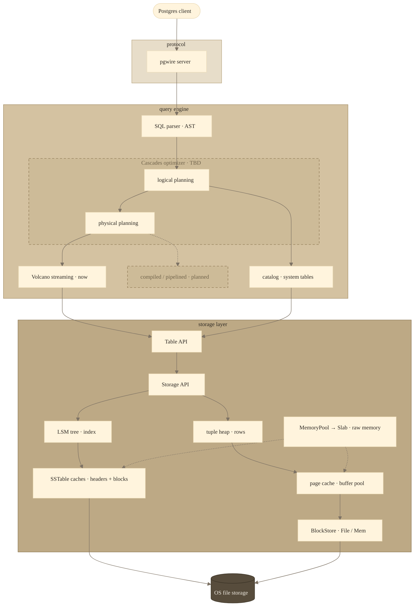

# 🗿 strata-db

[](https://github.com/nevzheng/strata-db/actions/workflows/ci.yml)
[](LICENSE)

[](CONTRIBUTING.md)
[](https://ossified-particle-27e.notion.site/Slate-37d624fc572e80b3b117ff61b594dc82)

**A database hewn from bedrock.**

strata-db is a database system, execution engine, and storage system, written from
scratch in Rust. A craft project: database engineering on my own terms, every layer
built from the bedrock up, free to explore wherever it leads.

> 🚧 **Work in progress.** Early and moving fast — interfaces, on-disk formats, and
> features change without notice.

## Influences & Directions

The systems that shape strata, and the directions I want to explore through it:

- **Log-Structured Merge storage:** RocksDB · Pebble · LevelDB — the foundation strata is built on.
- **In-memory storage:** Redis · VoltDB · SAP HANA · MonetDB — the whole working set in RAM.
- **OLTP:** PostgreSQL · CockroachDB · Spanner — the transactional direction I'm pursuing.
- **OLAP:** BigQuery · DuckDB · ClickHouse — the analytical direction I want to grow into.
- **HTAP:** HyPer · Umbra — doing both OLTP and OLAP well in the same system.
- **Single-node *and* cloud-native:** excellent on a laptop, excellent in the cluster.
- **AI / ML:** a grounded approach to AI/ML integrations and workloads — applying it to the project where sensible, and pursuing the use cases worth serving.

## Architecture

Read it from the bedrock up. Each layer is its own crate behind a clean boundary,
which keeps experimenting cheap: swap an implementation, try a different one, or
peel a layer off into its own service — without disturbing the rest.



| Component | Crate | What it does |
|---|---|---|
| **pgwire server** | `strata-server` | Speaks the Postgres wire protocol; one engine thread owns the database behind a channel. |
| **Planner** | `strata-db` | Parses SQL (sqlparser-rs, Postgres dialect), binds and type-checks against the catalog, and lowers to a physical plan. No cost-based optimization yet — a Cascades-style optimizer is the likely direction. |
| **Executor** | `strata-db` | Pull-based Volcano streaming — rows flow through operators on demand, nothing materialized. A compiled/pipelined path is planned. |
| **Catalog & schema** | `strata-db` | Projects, datasets, and tables, stored as system tables, over a small type system (bool, ints, text, bytes, json). |
| **Row / key encoding** | `strata-db` | Turns typed tuples into bytes, with order-preserving keys so range scans fall out of the sort order. |
| **Table API** | `strata-db` | Row-level insert / get / scan / delete over the storage engine. |
| **Storage API** | `strata-store` | Composes the LSM index (key → location) over the tuple heap (the bytes) into one store. |
| **LSM tree** | `lsm` | Journaled memtable that seals into immutable, bloom-filtered SSTables, tracked by a manifest for recovery. Reads fault SSTable headers — a 2-level partitioned block index — and data blocks through a shared read-through cache. |
| **Tuple heap + page cache** | `filesystem` | Fixed-size pages over the `BlockStore`, with pinning, dirty writeback, and LRU-K eviction; tuples addressed by a compact location. |
| **Block storage** | `filesystem` | The bedrock: a `BlockStore` trait with file (`FileBlockStore`) and in-memory (`MemBlockStore`) backends, addressed by an opaque `BlockId`. |
| **Memory** | `filesystem` | `MemoryPool` — the engine's allocator facade — hands out `Slab`s (raw byte spans) under one global cap; the caches and buffer pool are built to draw from it. |
| **Journal** | `journal` | A CRC-framed, fsync'd append-only log with replay. Backs both page mutations (`BlockJournal`) and the LSM memtable. |

## Repository layout

The Cargo workspace mirrors the layered architecture:

```
crates/      library crates
  journal      append-only crash-safe log
  lsm          LSM-tree index
  filesystem   storage foundation: memory, block storage, caches, tuple heap
  strata-store storage backend (LSM index over the heap)
  strata-db    SQL engine (planner, executor, catalog)
bins/        runnable binaries
  strata-server  pgwire server
  strata-cli     interactive client (binary name: `strata`)
crucible/    correctness & performance validation
  spec-test    E2E wire-protocol SQL tests (sqllogictest)
  bench/       benchmarking (TBD)
```

`crucible/` holds the project's validation harnesses: `spec-test` drives the
server end-to-end over the Postgres wire protocol, and `bench/` (planned) will
house performance benchmarks.

## Try it

Needs a recent Rust toolchain (2024 edition).

```bash
# build, then start the server (it speaks the Postgres wire protocol)
cargo build
cargo run -p strata-server -- --listen 127.0.0.1:5433 --data-dir ./strata-data
```

Connect with the bundled REPL — or any Postgres client, since it's pgwire:

```bash
cargo run -p strata-cli -- --host localhost --port 5433
psql -h localhost -p 5433
```

```sql
CREATE SCHEMA strata.demo;
CREATE TABLE strata.demo.events (id INT, name TEXT);
INSERT INTO strata.demo.events VALUES (1, 'alpha'), (2, 'bravo'), (3, 'charlie');

SELECT * FROM strata.demo.events WHERE id > 1;
-- 2  bravo
-- 3  charlie
```

Tables are named `project.dataset.table`.

## Docs & wiki

All documentation lives on Notion — **[Slate](https://ossified-particle-27e.notion.site/Slate-37d624fc572e80b3b117ff61b594dc82)**, the strata-db wiki: design docs, process docs, technical documentation, and meeting notes. _(WIP.)_

- **[Engineering Design Process](https://ossified-particle-27e.notion.site/Engineering-Design-Process-37d624fc572e80f59514c9314619fe4a)** — how design is run, with the ADR & design-doc templates
- **[Design Documents](https://ossified-particle-27e.notion.site/37d624fc572e809f9619fb97e4adb701?v=37d624fc572e8093a81e000c3af4cf44)** — ADRs, design docs, proposals
- **[Technical Documentation](https://ossified-particle-27e.notion.site/37d624fc572e80969646f2f66d82a167?v=37d624fc572e80fb8b15000ca035f017)** — how the system works, layer by layer

## Contributing

My craft project — solo-maintained, at my own pace and capacity.

- **Issues & PRs** — welcome. Open an issue before a big PR so we can align.
- **Direction** — I make the final call on scope and design.
- **Pace** — I can be slow; no promises on turnaround.

Full guide: [CONTRIBUTING](CONTRIBUTING.md).

## Follow along

I'm building strata-db in the open. Design notes and trade-offs go up on the blog as I go.

- **Blog** — [n8z.dev](https://n8z.dev)
- **Connect** — [LinkedIn](https://linkedin.com/in/nevinzheng) · [nevzheng@gmail.com](mailto:nevzheng@gmail.com)
- **Coffee** — [ko-fi.com/nevzheng](https://ko-fi.com/nevzheng) ☕

## License

MIT — see [LICENSE](LICENSE).

